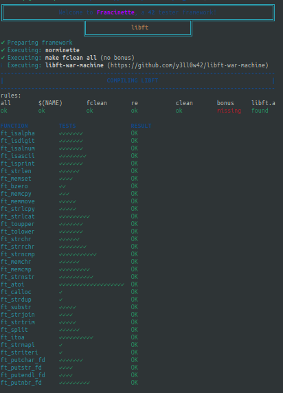
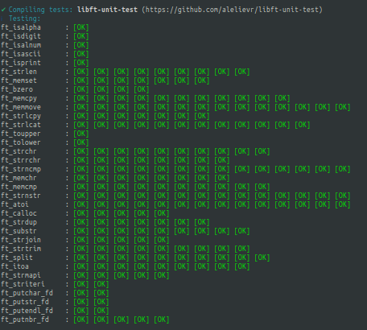
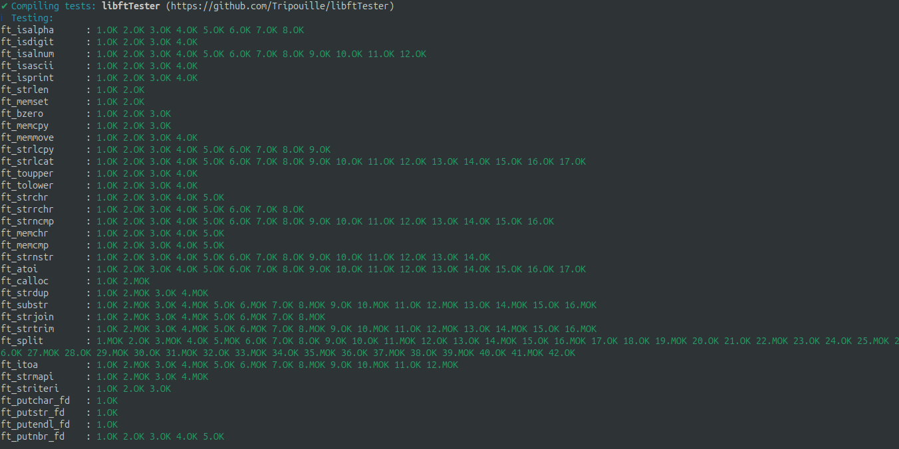
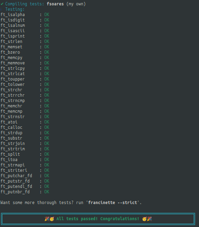

#  • 42_libft 
 

### Objective

Create a library called libft.a, which will contain various implemented functions, 
with behaviors similar to the functions of the standard C language library (libc), 
but with the prefix ft_ in the function names. 

### Files to submit 
 A Makefile: to automate the compilation of the library. 
    The header file libft.h: where the functions to be implemented will be declared. 
    The source code files, with names in the format ft_*.c: for example, ft_strlen.c, ft_isalpha.c, and so on. 

### Makefile Rules

In the Makefile, it's necessary to include the following commands: 
 
   NAME: the name of the library (in this case, libft.a). 
   all: command that will compile all files and create the library. 
   clean: command that deletes object files (.o). 
   fclean: command that deletes object files and the libft.a library. 
   re: command that executes fclean and then recompiles everything (a complete "rebuild"). 

### Technical Considerations

Global variables are prohibited. 
    Use static functions when auxiliary functions are needed within a file. 
    Place all files in the root directory of the repository.
    Compile the files with the flags: -Wall, -Wextra and -Werror. 
    The library must be created using the "ar" command and the generated file (libft.a) must be in the root directory. 

### Recreating standard library functions (Libc)

It's necessary to recreate the following functions from the standard C language library, using the prefix ft_ for each of them. 
The implementations must follow the specifications of the man page for each function, but without using the restrict qualifier (which is part of the C99 standard). Below is the list of functions: 
 
    Functions that don't use dynamic memory allocation: 
        isalpha, isdigit, isalnum, isascii, isprint 
        strlen, memset, bzero, memcpy, memmove 
        strlcpy, strlcat, toupper, tolower 
        strchr, strrchr, strncmp, memchr, memcmp 
        strnstr, atoi 
 
    Functions that require dynamic memory allocation (using malloc): 
        calloc, strdup 

### General Tips

 To understand how each function works, you can consult the "man pages" (for example, man strlen to see how strlen works). 
 When implementing the functions, follow the original signature, but add the ft_ prefix. For example: 
        int strlen(const char *s); → int ft_strlen(const char *s); 
    Make sure all functions compile correctly with warnings and errors enabled (flags: -Wall, -Wextra, -Werror). 

### Using the Makefile and creating the library

In the Makefile, use the "ar" command to create the static library from the .o files. Something like this: 

		makefile

		NAME = libft.a
		CC = gcc
		CFLAGS = -Wall -Wextra -Werror
		SRC = ft_strlen.c ft_isalpha.c ... # list of .c files
		OBJ = $(SRC:.c=.o)

		all: $(NAME)

		$(NAME): $(OBJ)
		ar rcs $(NAME) $(OBJ)

		clean:
		rm -f $(OBJ)
 
		fclean: clean
		rm -f $(NAME)

		re: fclean all

### Next steps

    Implement each function in its own .c file.
    Add the declaration of the functions in the libft.h file.
    Test the functions to ensure they behave as expected.
    Compile the library with the Makefile.
    

### Types of functions:

   	Character manipulation functions:
        ft_isalpha, ft_isdigit, ft_isalnum, ft_isascii, ft_isprint
        ft_toupper, ft_tolower

   	Basic memory manipulation functions:
        ft_memset, ft_bzero
        ft_memcpy, ft_memmove
        ft_memchr, ft_memcmp
        
    	Basic string manipulation functions:
        ft_strlen
        ft_strchr, ft_strrchr
        ft_strncmp
        ft_strlcpy, ft_strlcat
        
    	Conversion functions:
        ft_atoi
        ft_itoa
        
    	Memory allocation functions:
        ft_calloc
        ft_strdup
        
    	More complex string manipulation functions:
        ft_substr
        ft_strjoin
        ft_strtrim
        ft_split
        
    	Functions that use function pointers:
        ft_strmapi
        ft_striteri
        
    	Output functions:
        ft_putchar_fd, ft_putstr_fd, ft_putendl_fd, ft_putnbr_fd

### Study tips:

    Start with the simplest functions and progress gradually.
    For each function:
        Read the description and understand what it should do.
        Analyze the code line by line.
        Write comments explaining what each part of the code does.
        Try to rewrite the function on your own without looking at the original code.
        Create test cases to verify if the function works correctly.
    Use resources such as:
        The manual page (man) to understand the original libc functions.
        Draw diagrams to visualize how functions manipulate memory or strings.
        Write small programs that use these functions to see how they work in practice.
    Practice explaining each function out loud, as if you were teaching someone.
    Identify patterns and concepts that repeat across functions (such as memory allocation, iteration over strings, etc.).
    Don't hesitate to review basic C concepts, such as pointers, memory allocation, and string manipulation.

Remember, understanding comes with time and practice. 
Don't worry if you don't understand everything at once. Regularly revisit previous functions to reinforce your understanding.
Good luck with your studies!

### Some testers

[Francinette](https://github.com/xicodomingues/francinette) 
[libftTester](https://github.com/Tripouille/libftTester) 
[libft_Unit_test](https://github.com/alelievr/libft-unit-test) 
[libft-war-machine](https://github.com/0x050f/libft-war-machine)

### Earned skills

  

  

###### Projeto desenvolvido por: [Adão Gonçalves](https://github.com/AdaoG0n)

